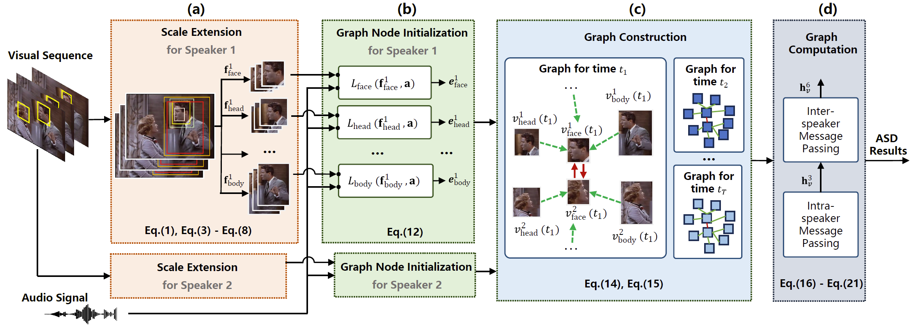

## MSSG: Multi-scale Speaker Graph Network for Active Speaker Detection

This repository contains the official implementation of our IEEE Transactions on Multimedia paper, **MSSG**.  
[[Paper Link](https://ieeexplore.ieee.org/abstract/document/11159256)]



---

### Dependencies

First, set up the environment:

```bash
conda create -n MSSG python=3.7.9 anaconda
conda activate MSSG
pip install -r requirement.txt
```

---

## 1. Data Preparation

Data preparation is handled by the script `data_prep.sh`.

There are 9 steps in total. Each step can be executed separately by running:

```bash
bash data_prep.sh x
```

For example:

```bash
bash data_prep.sh 0
```

- **Step 0**: Download the dataset. (Skip if you already have the AVA dataset.)  
- **Step 1**: Generate CSV files for later processing.  
- **Steps 2–8**: Generate images at multiple scales.  

---

## 2. Graph Initialization

Graph initialization is handled by the script `graph_init.sh`.

There are 9 steps in total. Each step can be executed separately:

```bash
bash graph_init.sh x
```

For example:

```bash
bash graph_init.sh 0
```

- **Step 0**: Pretraining to generate multi-scale graph node embeddings.  
  - Note: A pretrained model is already provided in this repository, so this step is optional.  
  - Averaging multiple models can further improve performance.  
  - Pretrained models are stored in `./predata/pretrain_model`.  
- **Steps 1–7**: Generate graph node embeddings using different pretrained models.  
- **Step 8**: Construct the graph.  

---

## 3. Graph Training

Graph training is handled by the script `graph_train.sh`.

Simply run:

```bash
bash graph_train.sh
```

---

## Citation

If you find our paper or code useful in your research, please cite:

```bibtex
@article{li2025mssg,
  title={MSSG: Multi-scale Speaker Graph Network for Active Speaker Detection},
  author={Li, Guanjun and Yi, Jiangyan and Wen, Zhengqi and Fu, Ruibo and Wang, Yuwang and Tao, Jianhua},
  journal={IEEE Transactions on Multimedia},
  year={2025},
  publisher={IEEE}
}
```

---

### Acknowledgments

We would like to thank the authors of the following works for open-sourcing their code, which provided invaluable insights:

- [TalKNet](https://github.com/TaoRuijie/TalkNet-ASD)  
- [SPELL](https://github.com/SRA2/SPELLD)  
- [Light-ASD](https://github.com/Junhua-Liao/Light-ASD)
